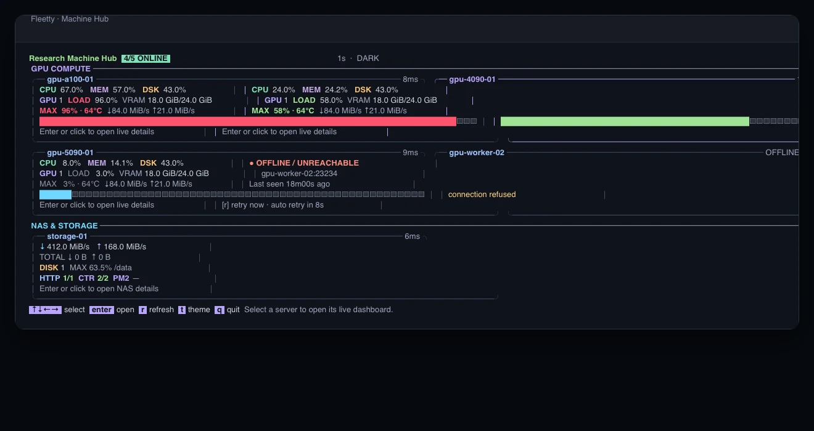
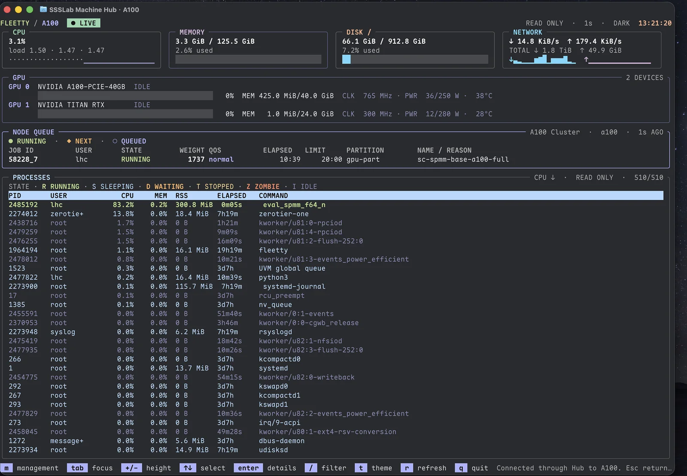
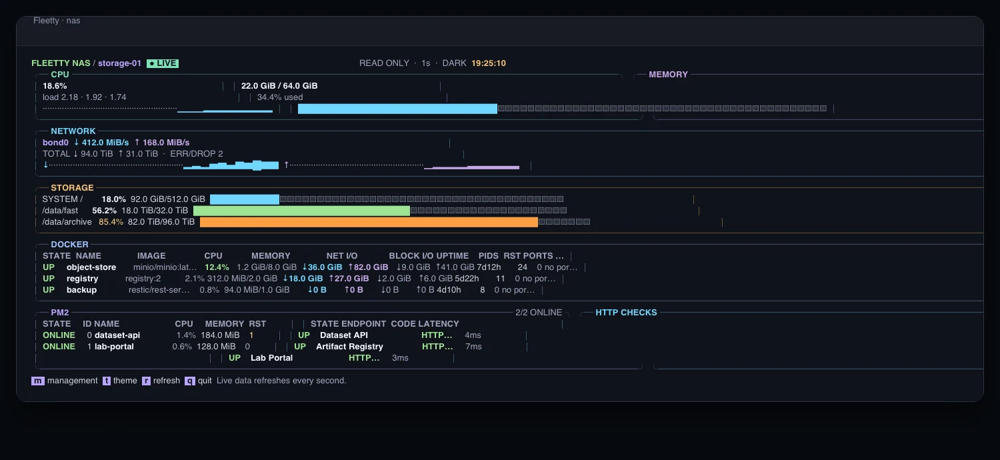

# Fleetty

<p align="center">
  
</p>

Fleetty 是一个面向个人电脑、计算服务器、存储节点和 Slurm 集群的终端监控控制台。它既可以作为本地 `top` 使用，也可以通过专用 SSH 端口提供不会暴露服务器 shell 的远程仪表盘。

它以单一可执行文件运行，适合为运维人员或服务器使用者提供统一、受控的主机状态入口。

## 功能概览

- CPU 使用率及 1/5/15 分钟负载；
- 内存与根磁盘容量、使用率；
- 网络实时收发速率、累计流量和最近 60 秒趋势；
- NVIDIA GPU 利用率、显存、核心频率、温度和功率；
- 按 CPU 排序的进程列表、状态颜色、过滤和只读详情；
- 随终端尺寸自动调整的响应式布局；
- 每个 SSH 会话独立的深色、浅色主题；
- 鼠标和键盘操作；
- Linux 与 macOS 本地 `fleetty top` 模式；
- 密码保护的管理模式；
- 可选的多服务器 Hub 首页；
- 内置幂等安装器、健康检查和批量 fleet 运维工具；
- 可接入多个本地或远程 Slurm 集群的队列页面；
- 面向 NAS 的网络、存储、Docker 和 HTTP 服务监控页面。

普通监控界面可以过滤进程并查看只读详情，不需要管理密码或 root 权限。管理模式可以向当前服务账户有权管理的进程发送 `SIGTERM`，并重启 Fleetty；可选的最小权限助手可以额外授权跨用户终止进程和重启主机。所有管理请求均为固定的结构化操作，不执行用户提供的 shell 命令。危险操作需要再次确认，PID 1 和监控程序自身不能从界面终止。

## 界面预览

以下截图来自 Fleetty 的实际运行界面。

### Machine Hub

按机器类型集中展示在线状态和核心指标，节点离线时保留最后在线时间并自动重试。

<a href="docs/images/fleetty-hub.webp">
  
</a>

<table>
  <tr>
    <td width="50%" valign="top">
      <strong>GPU 计算节点</strong><br>
      CPU、内存、磁盘、网络、GPU、Slurm 节点队列和进程统一呈现。<br><br>
      <a href="docs/images/fleetty-gpu.webp">
        
      </a>
    </td>
    <td width="50%" valign="top">
      <strong>NAS 与服务节点</strong><br>
      突出网络、挂载点、Docker、PM2 和 HTTP 服务健康状态。<br><br>
      <a href="docs/images/fleetty-nas.webp">
        
      </a>
    </td>
  </tr>
</table>

## 系统要求

- 本地监控支持 macOS，以及常见 Linux 发行版；
- SSH 节点、Hub 和特权助手需要使用 systemd 的 Linux；
- 支持 `amd64` 和 `arm64` 架构；
- NVIDIA GPU 指标需要系统已安装驱动并能执行 `nvidia-smi`。

普通用户即可安装和运行 Fleetty。macOS 本地模式显示 CPU、内存、磁盘、网络和进程，不显示 NVIDIA GPU 区域。Linux 没有 `nvidia-smi` 时，其他指标仍可正常使用。Docker socket、其他用户的进程详情等指标始终遵循操作系统原有访问权限。

## 安装

### macOS 本地监控

根据 Mac 的处理器下载二进制并校验：

```bash
case "$(uname -m)" in
  x86_64) fleetty_arch=amd64 ;;
  arm64) fleetty_arch=arm64 ;;
  *) echo "Unsupported architecture: $(uname -m)" >&2; exit 1 ;;
esac

fleetty_release_base="https://github.com/Rhythmicc/fleetty/releases/latest/download"
fleetty_asset="fleetty_darwin_${fleetty_arch}"

curl -fL -o "/tmp/${fleetty_asset}" \
  "${fleetty_release_base}/${fleetty_asset}"
curl -fL -o /tmp/fleetty-checksums.txt \
  "${fleetty_release_base}/checksums.txt"

fleetty_expected="$(
  awk -v asset="${fleetty_asset}" '$2 == asset { print $1 }' \
    /tmp/fleetty-checksums.txt
)"
fleetty_actual="$(shasum -a 256 "/tmp/${fleetty_asset}" | awk '{ print $1 }')"
test -n "${fleetty_expected}"
test "${fleetty_expected}" = "${fleetty_actual}"

mkdir -p "$HOME/.local/bin"
install -m 0755 "/tmp/${fleetty_asset}" "$HOME/.local/bin/fleetty"
```

直接启动本地仪表盘：

```bash
"$HOME/.local/bin/fleetty" top
```

`fleetty top --theme light` 使用浅色主题。该模式不启动后台服务、不开放网络端口，也不需要 root；`q` 退出，`t` 切换主题，`/` 过滤进程，方向键、回车和鼠标可以选择并查看进程详情。

### Linux SSH 节点

从 [GitHub Releases](https://github.com/Rhythmicc/fleetty/releases) 下载当前架构的最新版本：

```bash
case "$(uname -m)" in
  x86_64) fleetty_arch=amd64 ;;
  aarch64|arm64) fleetty_arch=arm64 ;;
  *) echo "Unsupported architecture: $(uname -m)" >&2; exit 1 ;;
esac

fleetty_release_base="https://github.com/Rhythmicc/fleetty/releases/latest/download"

curl -fL \
  -o "/tmp/fleetty_linux_${fleetty_arch}" \
  "${fleetty_release_base}/fleetty_linux_${fleetty_arch}"
curl -fL \
  -o /tmp/fleetty-checksums.txt \
  "${fleetty_release_base}/checksums.txt"

(
  cd /tmp
  grep "fleetty_linux_${fleetty_arch}$" fleetty-checksums.txt |
    sha256sum -c -
)
```

准备允许访问监控端口的 SSH 公钥，然后以当前普通用户运行内置安装器：

```bash
fleetty_config="$(mktemp -d)"
chmod 0700 "${fleetty_config}"
install -m 0600 "$HOME/.ssh/id_ed25519.pub" \
  "${fleetty_config}/authorized_keys"
chmod 0755 "/tmp/fleetty_linux_${fleetty_arch}"

"/tmp/fleetty_linux_${fleetty_arch}" install \
  --role node \
  --scope user \
  --config-dir "${fleetty_config}"
"$HOME/.local/bin/fleetty" doctor --role node --scope user
```

用户安装将程序放在 `~/.local/bin/fleetty`，配置放在 `~/.config/fleetty`，并创建 `fleetty.service` systemd user unit。服务默认监听 `0.0.0.0:23234`，但只接受 `authorized_keys` 中登记的客户端公钥。如需允许多人访问，将多行公钥写入同一个文件。

如果服务需要在用户完全退出后继续运行，请检查：

```bash
loginctl show-user "$USER" -p Linger
```

`Linger=no` 时可请管理员为该服务账户启用 lingering。无法使用 systemd user service 时，也可以以前台方式运行，监控功能本身不依赖 root：

```bash
SSH_HOST_KEY_PATH="$HOME/.config/fleetty/ssh_host_ed25519" \
SSH_AUTHORIZED_KEYS_FILE="$HOME/.config/fleetty/authorized_keys" \
"$HOME/.local/bin/fleetty" serve
```

需要统一的系统级服务以及重启主机等特权能力时，管理员可以改用：

```bash
sudo "/tmp/fleetty_linux_${fleetty_arch}" install \
  --role node \
  --scope system \
  --config-dir "${fleetty_config}"
sudo /opt/fleetty/fleetty doctor --role node --scope system
```

系统安装使用 `/opt/fleetty` 和 `/etc/fleetty`。两种安装首次启动时都会在各自配置目录创建 SSH host key，请勿在升级时删除。

如果服务器启用了防火墙，请只向需要访问监控的网络开放 TCP 23234 端口。

## 可重复部署与运维

Fleetty 自带幂等安装器。`--scope auto` 会在普通用户下选择 `user`，在 root 下选择 `system`。单机更新示例：

```bash
./fleetty_linux_amd64 install \
  --role node \
  --scope user \
  --config-dir ./node-config
~/.local/bin/fleetty doctor --role node --scope user
```

Hub 使用 `--role hub`。安装器会原子写入对应 scope 的二进制、配置和 systemd unit；文件内容没有变化时不会重启服务。如果服务启动失败，二进制、unit 和本次配置变更会自动回滚。

配置文件会由服务账户所有并使用 `0600` 权限。安装器拒绝符号链接、子目录、隐藏文件和超过限制的文件，未出现在配置目录中的现有配置不会被删除。

多机环境使用 `fleettyctl` 和 JSON fleet manifest。控制端可以是 Linux 或 macOS，SSH 连接沿用本机 OpenSSH config、代理和 host key 校验：

```bash
fleetty_release_base="https://github.com/Rhythmicc/fleetty/releases/latest/download"
fleettyctl_os="$(uname -s | tr '[:upper:]' '[:lower:]')"
case "$(uname -m)" in
  x86_64) fleettyctl_arch=amd64 ;;
  arm64|aarch64) fleettyctl_arch=arm64 ;;
  *) echo "Unsupported architecture: $(uname -m)" >&2; exit 1 ;;
esac
fleettyctl_asset="fleettyctl_${fleettyctl_os}_${fleettyctl_arch}"
curl -fL \
  -o "./${fleettyctl_asset}" \
  "${fleetty_release_base}/${fleettyctl_asset}"
curl -fL \
  -o ./fleetty-checksums.txt \
  "${fleetty_release_base}/checksums.txt"
fleettyctl_expected="$(
  awk -v asset="${fleettyctl_asset}" '$2 == asset { print $1 }' \
    ./fleetty-checksums.txt
)"
if [ "${fleettyctl_os}" = "darwin" ]; then
  fleettyctl_actual="$(shasum -a 256 "./${fleettyctl_asset}" | awk '{ print $1 }')"
else
  fleettyctl_actual="$(sha256sum "./${fleettyctl_asset}" | awk '{ print $1 }')"
fi
test -n "${fleettyctl_expected}"
test "${fleettyctl_expected}" = "${fleettyctl_actual}"
mv "./${fleettyctl_asset}" ./fleettyctl
chmod 0755 ./fleettyctl

fleettyctl validate --file fleet.json
fleettyctl plan --file fleet.json
fleettyctl apply --file fleet.json --yes
fleettyctl status --file fleet.json
```

示例：

```json
{
  "version": 1,
  "binary": "./fleetty_linux_amd64",
  "parallel": 4,
  "timeout_seconds": 15,
  "targets": [
    {
      "name": "gpu-1",
      "ssh": "gpu-1-admin",
      "role": "node",
      "scope": "user",
      "config_dir": "./config/gpu-1"
    },
    {
      "name": "lab-hub",
      "ssh": "hub-admin",
      "role": "hub",
      "scope": "system",
      "config_dir": "./config/hub"
    }
  ]
}
```

`binary` 和 `config_dir` 相对于 manifest 所在目录解析；单个目标可以用自己的 `binary` 覆盖全局值。`role` 可以为 `node`、`hub` 或仅支持 system scope 的 `privileged-helper`。`scope: "user"` 默认 `become: "none"`，整个部署过程不调用 sudo；`scope: "system"` 默认使用 `become: "sudo"`，使用 root SSH 时可以显式设置 `"become": "none"`。

manifest 不接受密码字段。SSH 凭据由 OpenSSH 管理，Fleetty 管理密码、RPC 私钥等敏感内容应放在目标的 `config_dir` 中，并确保该本地目录只有部署账户可读。`plan` 会比较二进制与受管配置的 SHA-256、服务启用状态和运行状态；`apply` 只处理有差异的目标，远端安装仍由同一个原子安装器完成。

只有 system scope 的部署账户等同于 root 级管理员：`become: "sudo"` 要求非交互式管理员 sudo，不能把它视为低权限授权。user scope 只管理该 SSH 用户自己的 Fleetty 文件和 user service，适合作为默认部署方式。

## 连接与操作

监控端口不会登录系统账户，SSH 用户名只用于标记会话来源；客户端仍需持有已登记的私钥，连接后不会获得 shell：

```bash
ssh -p 23234 monitor@example-host
```

### 监控页面

| 按键 | 功能 |
| --- | --- |
| `m` | 进入管理模式 |
| `t` | 切换当前会话的深色、浅色主题 |
| `r` | 立即刷新 |
| `q` | 退出 |

主题只影响当前 SSH 会话，不会改变其他已连接用户的界面。

只读监控页面不要求管理密码，但 SSH 连接本身必须通过公钥认证。只读进程详情会隐藏工作目录，并自动遮盖密码、令牌、API Key 等常见敏感参数；通过管理密码认证后才会显示完整详情。

### 管理模式

| 按键 | 功能 |
| --- | --- |
| `/` | 输入进程名、用户或 PID 进行过滤 |
| `↑` / `↓` | 选择进程 |
| `Enter` | 查看进程详情 |
| `t` | 在进程详情页请求终止进程 |
| `c` | 清除进程过滤条件 |
| `1` | 重启监控服务 |
| `2` | 重启主机；仅在当前服务账户具备并配置该能力时出现 |
| `Esc` | 返回上一层 |

支持鼠标的终端也可以直接点击进程和按钮。若 SSH 客户端不支持终端鼠标协议，请使用键盘操作。

## NAS 监控页面

将节点配置为 `nas` 后，默认页面会改为存储服务器视图，重点展示指定物理网卡的实时吞吐、累计流量、错误与丢包，各挂载点的容量告警，以及 Docker、PM2 和 HTTP 服务的健康状态。Docker 表格包含镜像、健康检查、CPU、内存、网络 I/O、进程数、重启次数、运行时间和端口；PM2 表格包含应用状态、实例 ID、PID、CPU、内存、运行时间、重启次数和执行模式。管理模式仍然可以查看和终止有权限管理的进程、重启监控服务；重启主机取决于安装 scope 和显式授权。

下载 NAS 配置示例并按实际环境修改。下面展示 system scope；user scope 将文件写入 `~/.config/fleetty`，并使用 `systemctl --user restart fleetty.service`：

```bash
fleetty_release_base="https://github.com/Rhythmicc/fleetty/releases/latest/download"
curl -fLO "${fleetty_release_base}/machine-nas.example.json"

sudo install -o root -g root -m 0600 \
  machine-nas.example.json \
  /etc/fleetty/machine.json
printf '%s\n' \
  'MACHINE_CONFIG_FILE=/etc/fleetty/machine.json' |
  sudo tee /etc/fleetty/machine.env >/dev/null
sudo chmod 0600 /etc/fleetty/machine.env
sudo systemctl restart fleetty.service
```

配置示例：

```json
{
  "name": "Storage NAS",
  "profile": "nas",
  "network_interfaces": ["eno1"],
  "mounts": ["/", "/mnt/storage-1", "/mnt/storage-2"],
  "docker": true,
  "pm2_user": "service-account",
  "http_checks": [
    {"name": "Web console", "url": "http://127.0.0.1/"},
    {"name": "Metrics", "url": "http://127.0.0.1:3000/"}
  ]
}
```

服务账户能够读取本机 Docker socket 时，Fleetty 会只读采集容器状态和资源数据，无需为了该功能直接以 root 运行。设置 `pm2_user` 后，监控程序会查找该用户已经运行的 PM2 daemon，并通过 `pm2 jlist` 读取应用状态；rootless 部署通常应使用同一个 PM2 用户。Fleetty 不会启动 PM2 daemon，也不会修改或重启应用。HTTP 检查由节点本机发起，因此可以检查只监听 `127.0.0.1` 的服务。请只配置可信 URL；监控程序不会读取完整响应正文，也不会显示或保存容器及 PM2 应用的环境变量。

## 多服务器 Hub

Hub 使用同一个 Go 可执行文件运行，并通过各节点现有的 23234 SSH 端口读取状态。连接 Hub 后会先看到所有服务器的简报，节点会根据 `profile` 自动分到 GPU 计算、NAS 与存储等区域；选择服务器即可进入该节点的完整监控和管理界面。Hub 名称由配置文件中的 `name` 决定，可以为不同实验室或集群分别命名。

Hub 不需要系统 SSH 账户，也不会在磁盘中保存节点管理密码。进入某个节点的管理模式时，密码会通过加密的 SSH 连接发送给该节点即时校验，并且只保留在当前 Hub 会话的内存中。

Hub 使用独立的 RPC 密钥连接节点。该密钥不能用于打开交互监控页面，普通操作者的密钥也不能冒充 Hub RPC 身份。

关机或暂时不可达的节点会显示为 `OFFLINE`，不会阻塞其他节点的每秒刷新。Hub 会逐步降低离线节点的探测频率，并在节点恢复后自动重新上线；也可以选中节点后按 `r` 立即重试。

部署 Hub 前，应先将各监控节点升级到相同版本。

### 创建节点配置

先在 Hub 主机上创建专用 RPC 密钥：

```bash
sudo ssh-keygen -t ed25519 -N "" \
  -f /etc/fleetty/node_rpc_ed25519
sudo chmod 0600 /etc/fleetty/node_rpc_ed25519
```

将 `/etc/fleetty/node_rpc_ed25519.pub` 的内容安装到每个节点的 `/etc/fleetty/hub_authorized_keys`，权限设为 `0600`。然后在每个节点的 `/etc/fleetty/machine.env` 中加入：

```bash
NODE_RPC_AUTHORIZED_KEYS_FILE=/etc/fleetty/hub_authorized_keys
```

更新配置后重启节点的 `fleetty.service`。节点只会允许这组公钥以内部用户 `fleetty-hub` 调用受限 RPC，不会提供 shell。

先在准备运行 Hub 的服务器上取得各节点的 SSH host key 指纹：

```bash
ssh-keyscan -p 23234 192.0.2.10 2>/dev/null |
  ssh-keygen -lf - -E sha256
```

复制示例配置并填写节点地址与指纹：

```bash
fleetty_release_base="https://github.com/Rhythmicc/fleetty/releases/latest/download"
curl -fLO "${fleetty_release_base}/hub-nodes.example.json"
curl -fLO "${fleetty_release_base}/fleetty-hub.service"

sudo install -o root -g root -m 0600 \
  hub-nodes.example.json \
  /etc/fleetty/nodes.json
sudo editor /etc/fleetty/nodes.json
```

配置格式如下：

```json
{
  "name": "Fleetty Hub",
  "refresh_seconds": 1,
  "nodes": [
    {
      "name": "training-1",
      "profile": "gpu",
      "description": "Training node",
      "address": "192.0.2.10:23234",
      "slurm_cluster": "Local GPU Cluster",
      "slurm_node": "gpu01",
      "identity_file": "/etc/fleetty/node_rpc_ed25519",
      "host_key": "SHA256:replace-with-the-node-host-key-fingerprint"
    },
    {
      "name": "storage-1",
      "profile": "nas",
      "description": "Storage and services",
      "address": "192.0.2.20:23234",
      "identity_file": "/etc/fleetty/node_rpc_ed25519",
      "host_key": "SHA256:replace-with-the-node-host-key-fingerprint"
    }
  ],
  "slurm_clusters": [
    {
      "name": "Local GPU Cluster",
      "description": "Slurm available on the Hub host",
      "transport": "local"
    },
    {
      "name": "Remote GPU Cluster",
      "description": "Slurm reached through a login node",
      "transport": "ssh",
      "address": "login.example.com:22",
      "user": "slurm-monitor",
      "identity_file": "/etc/fleetty/slurm_remote_ed25519",
      "host_keys": [
        "SHA256:replace-with-the-ed25519-host-key-fingerprint",
        "SHA256:replace-with-the-ecdsa-host-key-fingerprint"
      ],
      "partitions": ["gpu"],
      "refresh_seconds": 2,
      "timeout_seconds": 5
    }
  ]
}
```

`identity_file` 用于证明 Hub 身份，私钥必须由 root 所有且权限不超过 `0600`。`host_key` 用于防止 Hub 连接到被冒充的节点。节点重新生成 SSH host key 后，需要同步更新这里的指纹。

隔离网络中的旧节点可以在滚动迁移期间临时设置顶层字段 `"insecure_allow_unauthenticated_nodes": true`。该选项会降低 Hub 到节点的身份保证，不应作为长期配置；全部节点安装 RPC 公钥后应立即删除。

### Slurm 队列

Hub 可以同时读取多个互相独立的 Slurm 集群。每个集群对应一个 `slurm_clusters` 条目，计算节点名称、分区名称和登录节点位置均由配置决定。

`transport` 支持两种模式：

| 模式 | 适用场景 |
| --- | --- |
| `local` | Hub 就运行在 Slurm 登录节点上，或本机可以直接执行 `sinfo` 和 `squeue` |
| `ssh` | Slurm 位于另一套网络或登录节点后，Hub 使用只读 SSH 密钥远程执行 `sinfo` 和 `squeue` |

远程模式建议使用专用的低权限系统账户和独立密钥。私钥只需对 Hub 服务的 `root` 用户可读：

```bash
sudo ssh-keygen -t ed25519 -N "" \
  -f /etc/fleetty/slurm_remote_ed25519
sudo chmod 0600 /etc/fleetty/slurm_remote_ed25519
```

将生成的公钥加入远程登录节点上 `slurm-monitor` 用户的 `authorized_keys`，建议在公钥前添加 `restrict` 以禁用端口转发、PTY 和代理转发，并限制该账户的 sudo 权限。取得登录节点提供的 Host Key 指纹：

```bash
ssh-keyscan -p 22 login.example.com 2>/dev/null |
  ssh-keygen -lf - -E sha256
```

将输出中的全部有效 `SHA256:` 指纹写入 `host_keys`，以兼容登录节点同时发布 Ed25519、ECDSA 或 RSA Host Key 的情况。只登记一个指纹时，也可以继续使用单值字段 `host_key`。

可选的 `partitions` 只展示指定分区；省略时展示该集群的全部分区和作业。`refresh_seconds` 默认 2 秒，`timeout_seconds` 默认 4 秒。某个 Slurm 源离线时，Hub 会保留最后一次状态并单独退避重试，不影响服务器首页或其他集群。

计算节点可以通过 `slurm_cluster` 和 `slurm_node` 关联到队列数据。`slurm_cluster` 必须与某个集群的 `name` 完全相同，`slurm_node` 使用 `sinfo -N` 显示的节点名：

```json
{
  "name": "training-1",
  "profile": "gpu",
  "address": "192.0.2.10:23234",
  "identity_file": "/etc/fleetty/node_rpc_ed25519",
  "host_key": "SHA256:replace-with-the-node-host-key-fingerprint",
  "slurm_cluster": "Local GPU Cluster",
  "slurm_node": "gpu01"
}
```

建立关联后，从 Hub 打开的计算节点面板会显示有限条作业：当前节点正在运行的作业、调度顺序中最靠前且分区包含该节点的候选作业，以及少量后续排队作业。独立 Slurm 页面使用相同的颜色语义：

| 状态 | 含义 |
| --- | --- |
| `RUNNING` | 已分配到该节点或集群中正在运行 |
| `NEXT` | 当前队列顺序中最靠前的候选作业 |
| `QUEUED` | 其余等待调度的作业 |

`NEXT` 表示 Slurm `squeue` 返回顺序中的首个合资格 pending 作业，是便于观察的候选提示；最终调度仍由 Slurm 的优先级、资源、依赖和 backfill 策略决定。

`WEIGHT` 显示 Slurm `squeue %Q` 返回的原始总优先级。数值越高通常表示调度优先级越高，但它不是开工时间承诺；资源是否满足、依赖关系和 backfill 等策略仍会影响实际顺序。

`QOS` 显示 Slurm `squeue %q` 返回的服务质量名称，便于识别用户在提交任务时选择的优先级、时限或资源策略。

### 安装 Hub 服务

Hub 默认监听 23235，可以和本机的 23234 节点监控服务共存：

```bash
./fleetty_linux_amd64 install \
  --role hub \
  --scope user \
  --config-dir ./hub-config
~/.local/bin/fleetty doctor --role hub --scope user
```

`hub-config` 至少应包含 `authorized_keys` 和 `nodes.json`，以及配置引用的 RPC/Slurm 私钥。system scope 在安装命令前使用 `sudo` 并指定 `--scope system`。

连接 Hub：

```bash
ssh -p 23235 monitor@hub-host
```

| 按键 | 功能 |
| --- | --- |
| `↑` / `↓` / `←` / `→` | 选择服务器 |
| `Enter` | 打开所选服务器 |
| `Esc` | 从服务器详情返回 Hub 首页 |
| `s` | 打开 Slurm 队列 |
| `Tab` | 在服务器与 Slurm 页面之间切换 |
| `←` / `→` | 在 Slurm 页面按集群过滤 |
| `a` | 在 Slurm 页面恢复显示全部集群 |
| `r` | 立即刷新服务器和 Slurm 队列 |
| `t` | 切换当前会话的深色、浅色主题 |
| `q` | 在 Slurm 队列返回 Hub 首页；在 Hub 首页退出 |

首页和服务器卡片均支持鼠标点击。

在 GPU 计算节点详情中，`NODE QUEUE` 默认优先获得更多高度。布局调整只影响当前 SSH 会话，不会改变其他用户的界面：

| 按键 | 功能 |
| --- | --- |
| `Tab` | 在 `NODE QUEUE` 与 `PROCESSES` 之间切换焦点 |
| `+` / `-` | 增加或减少当前模块的高度 |
| `↑` / `↓` | 滚动队列，或选择进程 |
| `Enter` / 鼠标单击 | 查看所选进程的只读详情 |
| `/` | 按进程名、用户或 PID 过滤 |
| `c` | 清除进程过滤条件 |

只读详情不会提供终止入口。发送信号及其他主机写操作仍然只能在通过密码认证的管理模式中执行。

## 启用管理模式

管理模式默认关闭，配置管理密码后才会显示密码入口。推荐使用 bcrypt 哈希，不要保存明文密码。

Debian 或 Ubuntu 可以使用 `apache2-utils` 生成密码哈希；Fedora、RHEL 等系统可安装提供 `htpasswd` 的 `httpd-tools`：

```bash
sudo apt-get install apache2-utils

read -rsp "Management password: " monitor_admin_password
echo
monitor_admin_hash="$(
  htpasswd -bnBC 12 monitor "${monitor_admin_password}" | cut -d: -f2
)"
unset monitor_admin_password

printf '%s\n' \
  "ADMIN_PASSWORD_HASH=${monitor_admin_hash}" \
  >"$HOME/.config/fleetty/admin.env"
chmod 0600 "$HOME/.config/fleetty/admin.env"
systemctl --user restart fleetty.service
```

user scope 的管理模式可以终止该用户拥有的进程，并重启 Fleetty user service；其他用户的进程不会显示终止入口，重启主机按钮默认不存在。system scope 将配置写入 `/etc/fleetty/admin.env`，默认提供重启系统服务和主机的固定操作。

需要在保持 Fleetty 主服务为普通用户的同时授权少量系统操作时，可以安装可选的特权助手。先创建只能访问助手 socket 的系统组，并把 Fleetty 服务用户加入该组：

```bash
getent group fleetty >/dev/null || sudo groupadd --system fleetty
sudo usermod -aG fleetty "$USER"
```

重新登录以刷新用户组，然后使用同一个 Fleetty 二进制安装助手：

```bash
sudo "$HOME/.local/bin/fleetty" install \
  --role privileged-helper \
  --scope system
sudo /opt/fleetty/fleetty doctor \
  --role privileged-helper \
  --scope system
```

在 user scope 的 `admin.env` 中启用本地 socket：

```bash
printf '%s\n' \
  'FLEETTY_PRIVILEGED_SOCKET=/run/fleetty/privileged.sock' \
  >>"$HOME/.config/fleetty/admin.env"
chmod 0600 "$HOME/.config/fleetty/admin.env"
systemctl --user restart fleetty.service
```

助手以独立的加固服务运行，只接受以下操作：

- 重启固定的 `fleetty.service`；
- 重启主机；
- 对经过 PID 启动时间复核且不是 PID 1 的进程发送 `SIGTERM`。

Unix socket 的组权限决定哪些本地账户可以调用助手。协议不接受可执行文件、命令行或 shell 字符串，每次请求都会记录调用进程的 UID、GID、PID、操作类型、目标和结果。

## 配置

user scope 的配置位于 `~/.config/fleetty`，systemd unit 位于 `~/.config/systemd/user`；system scope 分别使用 `/etc/fleetty` 和 `/etc/systemd/system`。下表中的路径展示 system scope 默认值，user unit 会自动换成用户目录。

| 配置项 | 默认值 | 说明 |
| --- | --- | --- |
| `SSH_HOST` | `0.0.0.0` | 监听地址 |
| `SSH_PORT` | `23234` | 监听端口 |
| `SSH_HOST_KEY_PATH` | `/etc/fleetty/ssh_host_ed25519` | SSH host key |
| `SSH_AUTHORIZED_KEYS_FILE` | systemd 服务中为 `/etc/fleetty/authorized_keys` | 允许连接交互 TUI 的客户端公钥 |
| `NODE_RPC_AUTHORIZED_KEYS_FILE` | 空 | 允许以内部 Hub 身份连接节点的公钥 |
| `SSH_ALLOW_ANONYMOUS` | `false` | 仅用于隔离网络迁移；显式设为 `true` 才允许匿名连接 |
| `SSH_MAX_CONNECTIONS` | `64` | 同时接受的 SSH 连接上限 |
| `SSH_IDLE_TIMEOUT` | `30m` | SSH 空闲连接超时 |
| `SSH_MAX_TIMEOUT` | `24h` | 单个 SSH 连接的最长持续时间 |
| `DEFAULT_THEME` | `dark` | 新连接的默认主题，可设为 `light` |
| `MACHINE_CONFIG_FILE` | 空 | 节点角色、网卡、挂载点及服务检查 JSON 配置 |
| `HUB_NODES_FILE` | 空 | Hub 节点 JSON 配置；设置后首页切换为多服务器模式 |
| `ADMIN_PASSWORD_HASH` | 空 | bcrypt 管理密码哈希；为空时禁用管理模式 |
| `FLEETTY_PRIVILEGED_SOCKET` | 空 | 可选的特权助手 Unix socket；通常为 `/run/fleetty/privileged.sock` |

user scope 修改配置后执行：

```bash
systemctl --user daemon-reload
systemctl --user restart fleetty.service
```

## 升级

按照“安装”章节下载并校验新版本，然后再次运行幂等安装器：

```bash
"/tmp/fleetty_linux_${fleetty_arch}" install --role node --scope user
```

system scope 在命令前使用 `sudo` 并指定 `--scope system`。已有客户端公钥、RPC 密钥、管理配置和 SSH host key 不会被删除；Hub 主机使用 `--role hub`。

## 故障排查

查看服务状态和最近日志：

```bash
systemctl --user status fleetty.service
journalctl --user -u fleetty.service -n 100 --no-pager
```

- 无法连接：检查服务状态、TCP 23234 端口、防火墙规则和客户端公钥是否存在于 `authorized_keys`；
- GPU 区域不可用：确认 `nvidia-smi` 能以运行 Fleetty 的用户身份正常执行；
- user service 在退出后停止：检查 `loginctl show-user "$USER" -p Linger`；
- 管理模式不可用：检查对应 scope 的 `admin.env` 权限和 `ADMIN_PASSWORD_HASH`；
- Hub 节点离线：确认 Hub 能访问节点的 TCP 23234 端口，并检查 `identity_file`、节点的 `hub_authorized_keys` 和 `host_key` 指纹；
- 鼠标无法点击：改用键盘，或检查终端及 SSH 客户端的鼠标协议支持；
- 界面字符错位：使用支持 Unicode 和等宽字符的终端字体。

## 卸载

```bash
systemctl --user disable --now fleetty.service
rm "$HOME/.config/systemd/user/fleetty.service"
systemctl --user daemon-reload
rm "$HOME/.local/bin/fleetty"
```

如需同时删除管理配置和 SSH host key，再删除 `~/.config/fleetty`。system scope 的卸载命令使用 `sudo systemctl`，对应路径为 `/etc/systemd/system/fleetty.service`、`/opt/fleetty` 和 `/etc/fleetty`。

安装了 Hub 时，将服务名换成 `fleetty-hub.service`；user scope 继续使用 `systemctl --user`，system scope 使用 `sudo systemctl`。`nodes.json` 中只包含节点地址和 host key 指纹，可以按需要保留或删除。
